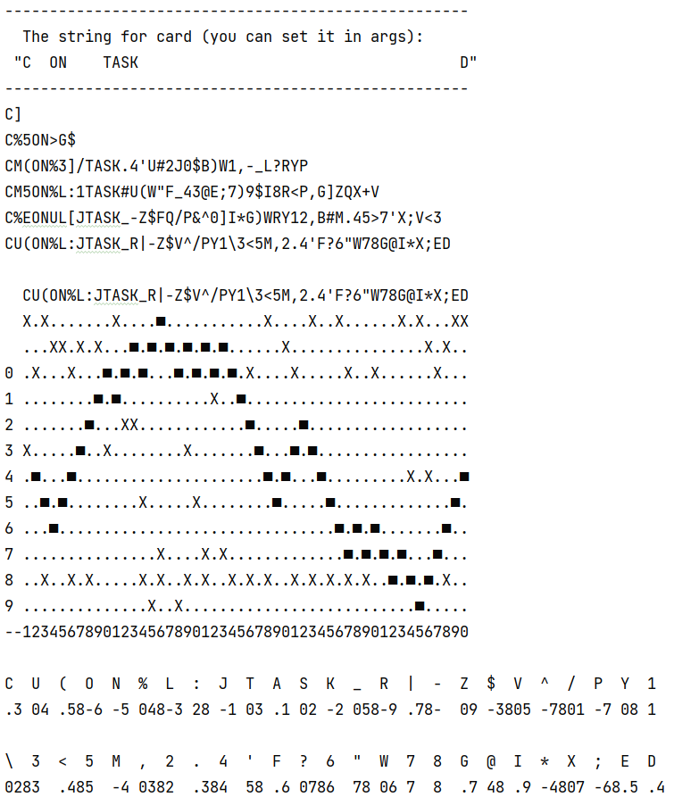

Join us virtually for Google I/O.

Connect with developers from around the world at this year’s virtual Google I/O for thoughtful discussions, hands-on
learning with Google experts, and a first look at our latest developer products. Until the event starts, try solving the
I/O 2021 puzzle.

See details here:
https://events.google.com/io/punchcard?lng=en

**THE CODE JUST DRAFT. NO USE IT ;)**

**My autogenerator for step 2 and may be more.**

output for example:

